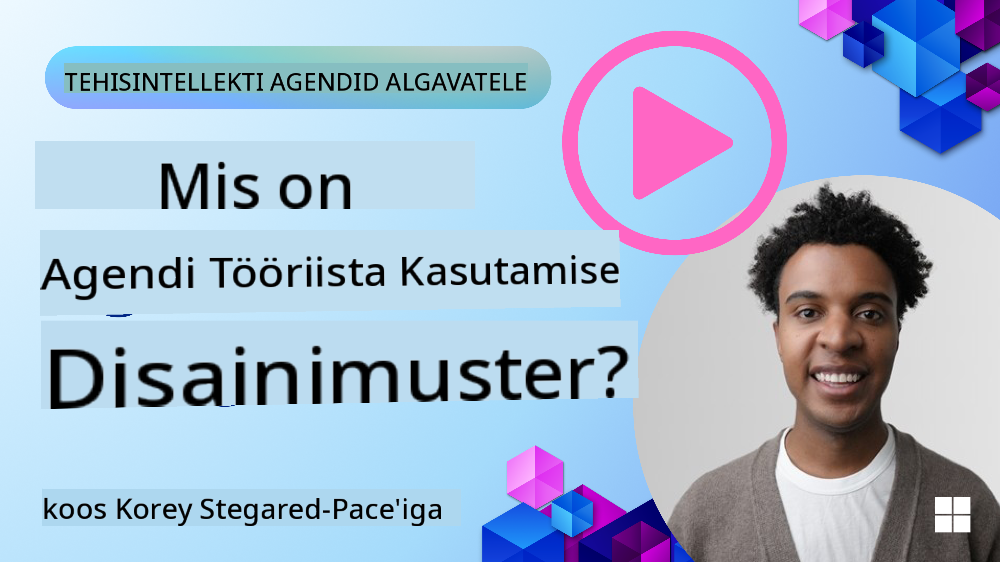
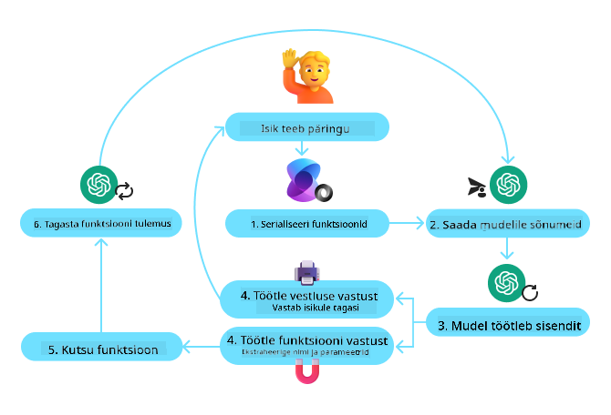
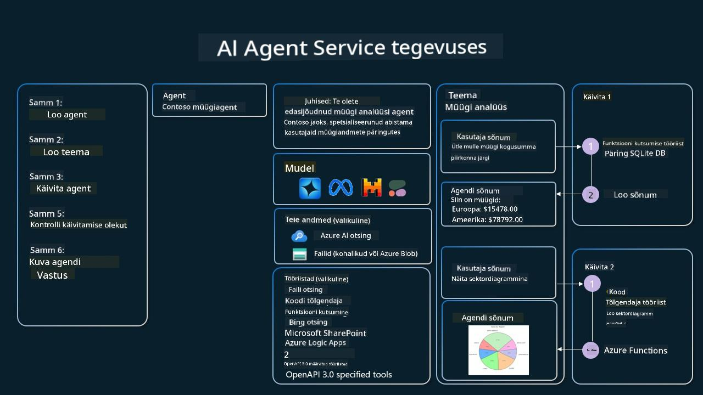

<!--
CO_OP_TRANSLATOR_METADATA:
{
  "original_hash": "d7c3b7bd1b3528074d8b6a7c5ad33b6f",
  "translation_date": "2025-11-18T18:44:13+00:00",
  "source_file": "04-tool-use/README.md",
  "language_code": "et"
}
-->
[](https://youtu.be/vieRiPRx-gI?si=cEZ8ApnT6Sus9rhn)

> _(Klõpsake ülaloleval pildil, et vaadata selle õppetunni videot)_

# Tööriistade kasutamise kujundusmuster

Tööriistad on huvitavad, kuna need võimaldavad AI agentidel omada laiemat valikut võimeid. Selle asemel, et agendil oleks piiratud hulk toiminguid, mida ta saab teha, võimaldab tööriista lisamine agendil nüüd täita mitmesuguseid toiminguid. Selles peatükis vaatleme tööriistade kasutamise kujundusmustrit, mis kirjeldab, kuidas AI agendid saavad kasutada konkreetseid tööriistu oma eesmärkide saavutamiseks.

## Sissejuhatus

Selles õppetunnis püüame vastata järgmistele küsimustele:

- Mis on tööriistade kasutamise kujundusmuster?
- Millistele kasutusjuhtudele saab seda rakendada?
- Millised elemendid/ehitusplokid on vajalikud kujundusmustri rakendamiseks?
- Millised on erikaalutlused tööriistade kasutamise kujundusmustri rakendamisel usaldusväärsete AI agentide loomiseks?

## Õppeeesmärgid

Pärast selle õppetunni läbimist suudate:

- Defineerida tööriistade kasutamise kujundusmustri ja selle eesmärgi.
- Tuvastada kasutusjuhud, kus tööriistade kasutamise kujundusmuster on rakendatav.
- Mõista peamisi elemente, mis on vajalikud kujundusmustri rakendamiseks.
- Tunnustada kaalutlusi, mis tagavad usaldusväärsuse AI agentides, mis kasutavad seda kujundusmustrit.

## Mis on tööriistade kasutamise kujundusmuster?

**Tööriistade kasutamise kujundusmuster** keskendub sellele, et anda LLM-idele (suured keelemudelid) võime suhelda väliste tööriistadega, et saavutada konkreetseid eesmärke. Tööriistad on kood, mida agent saab täita toimingute tegemiseks. Tööriist võib olla lihtne funktsioon, näiteks kalkulaator, või API-kõne kolmanda osapoole teenusele, näiteks aktsiahindade otsing või ilmateade. AI agentide kontekstis on tööriistad loodud selleks, et agendid saaksid neid täita vastuseks **mudeli genereeritud funktsioonikõnedele**.

## Millistele kasutusjuhtudele saab seda rakendada?

AI agendid saavad kasutada tööriistu keerukate ülesannete täitmiseks, teabe hankimiseks või otsuste tegemiseks. Tööriistade kasutamise kujundusmustrit kasutatakse sageli stsenaariumides, mis nõuavad dünaamilist suhtlust väliste süsteemidega, nagu andmebaasid, veebiteenused või koodi tõlgendajad. See võime on kasulik mitmesuguste kasutusjuhtude jaoks, sealhulgas:

- **Dünaamiline teabe hankimine:** Agendid saavad pärida väliseid API-sid või andmebaase, et hankida ajakohastatud andmeid (nt päring SQLite andmebaasist andmeanalüüsiks, aktsiahindade või ilmateabe hankimine).
- **Koodi täitmine ja tõlgendamine:** Agendid saavad täita koodi või skripte matemaatiliste probleemide lahendamiseks, aruannete loomiseks või simulatsioonide tegemiseks.
- **Töövoo automatiseerimine:** Korduvate või mitmeastmeliste töövoogude automatiseerimine, integreerides tööriistu nagu ülesannete planeerijad, e-posti teenused või andmetorud.
- **Klienditugi:** Agendid saavad suhelda CRM-süsteemide, piletiplatvormide või teadmistebaasidega, et lahendada kasutajate päringuid.
- **Sisu loomine ja redigeerimine:** Agendid saavad kasutada tööriistu, nagu grammatikakontrollijad, teksti kokkuvõtjad või sisuturvalisuse hindajad, et aidata sisuloome ülesannetes.

## Millised elemendid/ehitusplokid on vajalikud tööriistade kasutamise kujundusmustri rakendamiseks?

Need ehitusplokid võimaldavad AI agendil täita mitmesuguseid ülesandeid. Vaatame peamisi elemente, mis on vajalikud tööriistade kasutamise kujundusmustri rakendamiseks:

- **Funktsiooni/tööriista skeemid:** Saadaval olevate tööriistade üksikasjalikud määratlused, sealhulgas funktsiooni nimi, eesmärk, vajalikud parameetrid ja oodatavad väljundid. Need skeemid võimaldavad LLM-il mõista, millised tööriistad on saadaval ja kuidas koostada kehtivaid päringuid.

- **Funktsiooni täitmise loogika:** Juhib, kuidas ja millal tööriistu kasutatakse vastavalt kasutaja kavatsusele ja vestluse kontekstile. See võib hõlmata planeerimismooduleid, suunamismehhanisme või tingimuslikke vooge, mis määravad tööriistade kasutamise dünaamiliselt.

- **Sõnumite haldussüsteem:** Komponendid, mis haldavad vestluse voogu kasutaja sisendite, LLM-i vastuste, tööriistakõnede ja tööriistade väljundite vahel.

- **Tööriistade integreerimise raamistik:** Infrastruktuur, mis ühendab agendi erinevate tööriistadega, olgu need lihtsad funktsioonid või keerulised välised teenused.

- **Vigade käsitlemine ja valideerimine:** Mehhanismid tööriistade täitmise ebaõnnestumiste käsitlemiseks, parameetrite valideerimiseks ja ootamatute vastuste haldamiseks.

- **Oleku haldamine:** Jälgib vestluse konteksti, varasemaid tööriistade interaktsioone ja püsivaid andmeid, et tagada järjepidevus mitme pöördega interaktsioonides.

Järgmisena vaatame funktsiooni/tööriista kõnesid lähemalt.

### Funktsiooni/tööriista kõned

Funktsioonikõned on peamine viis, kuidas võimaldame suurte keelemudelite (LLM-id) suhtlemist tööriistadega. Sageli kasutatakse "funktsiooni" ja "tööriista" vaheldumisi, kuna "funktsioonid" (taaskasutatava koodi plokid) on "tööriistad", mida agendid kasutavad ülesannete täitmiseks. Selleks, et funktsiooni kood täidetaks, peab LLM võrdlema kasutaja päringut funktsiooni kirjeldusega. Selleks saadetakse LLM-ile skeem, mis sisaldab kõigi saadaolevate funktsioonide kirjeldusi. LLM valib ülesande jaoks kõige sobivama funktsiooni ja tagastab selle nime ja argumendid. Valitud funktsioon täidetakse, selle vastus saadetakse tagasi LLM-ile, mis kasutab teavet kasutaja päringule vastamiseks.

Arendajatel, kes soovivad rakendada funktsioonikõnesid agentidele, on vaja:

1. LLM-mudelit, mis toetab funktsioonikõnesid
2. Skeemi, mis sisaldab funktsioonide kirjeldusi
3. Koodi iga kirjeldatud funktsiooni jaoks

Vaatame näidet, kuidas saada praegust aega linnas:

1. **LLM-i, mis toetab funktsioonikõnesid, initsialiseerimine:**

    Kõik mudelid ei toeta funktsioonikõnesid, seega on oluline kontrollida, et kasutatav LLM seda teeb. <a href="https://learn.microsoft.com/azure/ai-services/openai/how-to/function-calling" target="_blank">Azure OpenAI</a> toetab funktsioonikõnesid. Alustame Azure OpenAI kliendi initsialiseerimisest.

    ```python
    # Initialize the Azure OpenAI client
    client = AzureOpenAI(
        azure_endpoint = os.getenv("AZURE_OPENAI_ENDPOINT"), 
        api_key=os.getenv("AZURE_OPENAI_API_KEY"),  
        api_version="2024-05-01-preview"
    )
    ```

1. **Funktsiooni skeemi loomine:**

    Järgmisena määratleme JSON-skeemi, mis sisaldab funktsiooni nime, funktsiooni eesmärgi kirjeldust ning funktsiooni parameetrite nimesid ja kirjeldusi. Seejärel edastame selle skeemi varem loodud kliendile koos kasutaja päringuga, et leida aeg San Franciscos. Oluline on märkida, et tagastatakse **tööriistakõne**, mitte küsimuse lõplik vastus. Nagu varem mainitud, tagastab LLM ülesande jaoks valitud funktsiooni nime ja argumendid, mis sellele edastatakse.

    ```python
    # Function description for the model to read
    tools = [
        {
            "type": "function",
            "function": {
                "name": "get_current_time",
                "description": "Get the current time in a given location",
                "parameters": {
                    "type": "object",
                    "properties": {
                        "location": {
                            "type": "string",
                            "description": "The city name, e.g. San Francisco",
                        },
                    },
                    "required": ["location"],
                },
            }
        }
    ]
    ```
   
    ```python
  
    # Initial user message
    messages = [{"role": "user", "content": "What's the current time in San Francisco"}] 
  
    # First API call: Ask the model to use the function
      response = client.chat.completions.create(
          model=deployment_name,
          messages=messages,
          tools=tools,
          tool_choice="auto",
      )
  
      # Process the model's response
      response_message = response.choices[0].message
      messages.append(response_message)
  
      print("Model's response:")  

      print(response_message)
  
    ```

    ```bash
    Model's response:
    ChatCompletionMessage(content=None, role='assistant', function_call=None, tool_calls=[ChatCompletionMessageToolCall(id='call_pOsKdUlqvdyttYB67MOj434b', function=Function(arguments='{"location":"San Francisco"}', name='get_current_time'), type='function')])
    ```
  
1. **Funktsiooni kood, mis on vajalik ülesande täitmiseks:**

    Nüüd, kui LLM on valinud, millist funktsiooni tuleb käivitada, tuleb rakendada ja täita kood, mis ülesande täidab. Saame rakendada koodi praeguse aja saamiseks Pythonis. Samuti peame kirjutama koodi, et vastuse sõnumist funktsiooni nimi ja argumendid välja võtta, et saada lõplik tulemus.

    ```python
      def get_current_time(location):
        """Get the current time for a given location"""
        print(f"get_current_time called with location: {location}")  
        location_lower = location.lower()
        
        for key, timezone in TIMEZONE_DATA.items():
            if key in location_lower:
                print(f"Timezone found for {key}")  
                current_time = datetime.now(ZoneInfo(timezone)).strftime("%I:%M %p")
                return json.dumps({
                    "location": location,
                    "current_time": current_time
                })
      
        print(f"No timezone data found for {location_lower}")  
        return json.dumps({"location": location, "current_time": "unknown"})
    ```

     ```python
     # Handle function calls
      if response_message.tool_calls:
          for tool_call in response_message.tool_calls:
              if tool_call.function.name == "get_current_time":
     
                  function_args = json.loads(tool_call.function.arguments)
     
                  time_response = get_current_time(
                      location=function_args.get("location")
                  )
     
                  messages.append({
                      "tool_call_id": tool_call.id,
                      "role": "tool",
                      "name": "get_current_time",
                      "content": time_response,
                  })
      else:
          print("No tool calls were made by the model.")  
  
      # Second API call: Get the final response from the model
      final_response = client.chat.completions.create(
          model=deployment_name,
          messages=messages,
      )
  
      return final_response.choices[0].message.content
     ```

     ```bash
      get_current_time called with location: San Francisco
      Timezone found for san francisco
      The current time in San Francisco is 09:24 AM.
     ```

Funktsioonikõned on enamiku, kui mitte kõigi agentide tööriistade kasutamise kujunduse keskmes, kuid selle nullist rakendamine võib mõnikord olla keeruline. Nagu õppisime [2. õppetunnis](../../../02-explore-agentic-frameworks), pakuvad agentlikud raamistikud meile eelnevalt ehitatud ehitusplokke tööriistade kasutamise rakendamiseks.

## Tööriistade kasutamise näited agentlike raamistikudega

Siin on mõned näited, kuidas saate rakendada tööriistade kasutamise kujundusmustrit erinevate agentlike raamistikudega:

### Semantic Kernel

<a href="https://learn.microsoft.com/azure/ai-services/agents/overview" target="_blank">Semantic Kernel</a> on avatud lähtekoodiga AI raamistik .NET-, Python- ja Java-arendajatele, kes töötavad suurte keelemudelitega (LLM-id). See lihtsustab funktsioonikõnede kasutamise protsessi, kirjeldades automaatselt teie funktsioone ja nende parameetreid mudelile protsessi kaudu, mida nimetatakse <a href="https://learn.microsoft.com/semantic-kernel/concepts/ai-services/chat-completion/function-calling/?pivots=programming-language-python#1-serializing-the-functions" target="_blank">serialiseerimiseks</a>. Samuti haldab see mudeli ja teie koodi vahelist suhtlust. Teine eelis agentliku raamistiku, nagu Semantic Kernel, kasutamisel on see, et see võimaldab teil kasutada eelnevalt ehitatud tööriistu, nagu <a href="https://github.com/microsoft/semantic-kernel/blob/main/python/samples/getting_started_with_agents/openai_assistant/step4_assistant_tool_file_search.py" target="_blank">Failiotsing</a> ja <a href="https://github.com/microsoft/semantic-kernel/blob/main/python/samples/getting_started_with_agents/openai_assistant/step3_assistant_tool_code_interpreter.py" target="_blank">Koodi tõlgendaja</a>.

Järgmine diagramm illustreerib funktsioonikõnede protsessi Semantic Kerneliga:



Semantic Kernelis nimetatakse funktsioone/tööriistu <a href="https://learn.microsoft.com/semantic-kernel/concepts/plugins/?pivots=programming-language-python" target="_blank">Pluginadeks</a>. Saame muuta varem nähtud `get_current_time` funktsiooni pluginaks, muutes selle klassiks, milles funktsioon asub. Samuti saame importida `kernel_function` dekoratori, mis võtab funktsiooni kirjelduse. Kui loote seejärel kerneli GetCurrentTimePluginiga, serialiseerib kernel automaatselt funktsiooni ja selle parameetrid, luues skeemi, mida LLM-ile saata.

```python
from semantic_kernel.functions import kernel_function

class GetCurrentTimePlugin:
    async def __init__(self, location):
        self.location = location

    @kernel_function(
        description="Get the current time for a given location"
    )
    def get_current_time(location: str = ""):
        ...

```

```python 
from semantic_kernel import Kernel

# Create the kernel
kernel = Kernel()

# Create the plugin
get_current_time_plugin = GetCurrentTimePlugin(location)

# Add the plugin to the kernel
kernel.add_plugin(get_current_time_plugin)
```
  
### Azure AI Agent Service

<a href="https://learn.microsoft.com/azure/ai-services/agents/overview" target="_blank">Azure AI Agent Service</a> on uuem agentlik raamistik, mis on loodud selleks, et anda arendajatele võimalus turvaliselt luua, juurutada ja laiendada kvaliteetseid ning laiendatavaid AI agente, ilma et oleks vaja hallata aluseks olevaid arvutus- ja salvestusressursse. See on eriti kasulik ettevõtte rakenduste jaoks, kuna tegemist on täielikult hallatud teenusega, millel on ettevõtte tasemel turvalisus.

Kui võrrelda arendamist otse LLM API-ga, pakub Azure AI Agent Service mõningaid eeliseid, sealhulgas:

- Automaatne tööriistakõne – pole vaja tööriistakõnet parsida, tööriista käivitada ja vastust käsitleda; kõik see tehakse nüüd serveripoolselt
- Turvaliselt hallatud andmed – vestluse oleku haldamise asemel saate tugineda lõimedele, et salvestada kogu vajalik teave
- Valmis tööriistad – Tööriistad, mida saate kasutada oma andmeallikatega suhtlemiseks, nagu Bing, Azure AI Search ja Azure Functions.

Azure AI Agent Service'is saadaval olevad tööriistad saab jagada kahte kategooriasse:

1. Teadmiste tööriistad:
    - <a href="https://learn.microsoft.com/azure/ai-services/agents/how-to/tools/bing-grounding?tabs=python&pivots=overview" target="_blank">Bing Searchi abil maandamine</a>
    - <a href="https://learn.microsoft.com/azure/ai-services/agents/how-to/tools/file-search?tabs=python&pivots=overview" target="_blank">Failiotsing</a>
    - <a href="https://learn.microsoft.com/azure/ai-services/agents/how-to/tools/azure-ai-search?tabs=azurecli%2Cpython&pivots=overview-azure-ai-search" target="_blank">Azure AI Search</a>

2. Toimingute tööriistad:
    - <a href="https://learn.microsoft.com/azure/ai-services/agents/how-to/tools/function-calling?tabs=python&pivots=overview" target="_blank">Funktsioonikõned</a>
    - <a href="https://learn.microsoft.com/azure/ai-services/agents/how-to/tools/code-interpreter?tabs=python&pivots=overview" target="_blank">Koodi tõlgendaja</a>
    - <a href="https://learn.microsoft.com/azure/ai-services/agents/how-to/tools/openapi-spec?tabs=python&pivots=overview" target="_blank">OpenAPI määratletud tööriistad</a>
    - <a href="https://learn.microsoft.com/azure/ai-services/agents/how-to/tools/azure-functions?pivots=overview" target="_blank">Azure Functions</a>

Agent Service võimaldab meil kasutada neid tööriistu koos `tööriistakomplektina`. Samuti kasutab see `lõime`, mis jälgib konkreetse vestluse sõnumite ajalugu.

Kujutage ette, et olete müügiagent ettevõttes nimega Contoso. Soovite arendada vestlusagenti, mis suudab vastata küsimustele teie müügiandmete kohta.

Järgmine pilt illustreerib, kuidas saaksite kasutada Azure AI Agent Service'i oma müügiandmete analüüsimiseks:



Nende tööriistade kasutamiseks teenusega saame luua kliendi ja määratleda tööriista või tööriistakomplekti. Selle praktiliseks rakendamiseks saame kasutada järgmist Pythoni koodi. LLM suudab vaadata tööriistakomplekti ja otsustada, kas kasutada kasutaja loodud funktsiooni `fetch_sales_data_using_sqlite_query` või eelnevalt ehitatud koodi tõlgendajat, sõltuvalt kasutaja päringust.

```python 
import os
from azure.ai.projects import AIProjectClient
from azure.identity import DefaultAzureCredential
from fetch_sales_data_functions import fetch_sales_data_using_sqlite_query # fetch_sales_data_using_sqlite_query function which can be found in a fetch_sales_data_functions.py file.
from azure.ai.projects.models import ToolSet, FunctionTool, CodeInterpreterTool

project_client = AIProjectClient.from_connection_string(
    credential=DefaultAzureCredential(),
    conn_str=os.environ["PROJECT_CONNECTION_STRING"],
)

# Initialize function calling agent with the fetch_sales_data_using_sqlite_query function and adding it to the toolset
fetch_data_function = FunctionTool(fetch_sales_data_using_sqlite_query)
toolset = ToolSet()
toolset.add(fetch_data_function)

# Initialize Code Interpreter tool and adding it to the toolset. 
code_interpreter = code_interpreter = CodeInterpreterTool()
toolset = ToolSet()
toolset.add(code_interpreter)

agent = project_client.agents.create_agent(
    model="gpt-4o-mini", name="my-agent", instructions="You are helpful agent", 
    toolset=toolset
)
```

## Millised on erikaalutlused tööriistade kasutamise kujundusmustri rakendamisel usaldusväärsete AI agentide loomiseks?

LLM-ide poolt dünaamiliselt genereeritud SQL-i puhul on tavaliseks mureks turvalisus, eriti SQL-i süstimise või pahatahtlike toimingute, nagu andmebaasi kustutamine või rikkumine, oht. Kuigi need mured on õigustatud, saab neid tõhusalt leevendada, konfigureerides õigesti andmebaasi juurdepääsuõigused. Enamiku andmebaaside puhul hõlmab see andmebaasi seadistamist ainult lugemiseks. Selliste andmebaasiteenuste puhul nagu PostgreSQL või Azure SQL tuleks rakendusele määrata ainult lugemisõigusega (SELECT) roll.
Rakenduse käitamine turvalises keskkonnas suurendab veelgi kaitset. Ettevõtete stsenaariumides ekstraheeritakse ja töödeldakse andmeid tavaliselt operatsioonisüsteemidest kirjutuskaitstud andmebaasi või andmelaosse, millel on kasutajasõbralik skeem. See lähenemine tagab, et andmed on turvalised, optimeeritud jõudluse ja juurdepääsetavuse jaoks ning et rakendusel on piiratud, ainult lugemisõigusega juurdepääs.

## Näidiskoodid

- Python: [Agent Framework](./code_samples/04-python-agent-framework.ipynb)
- .NET: [Agent Framework](./code_samples/04-dotnet-agent-framework.md)

## Kas on rohkem küsimusi tööriista kasutamise disainimustrite kohta?

Liitu [Azure AI Foundry Discordiga](https://aka.ms/ai-agents/discord), et kohtuda teiste õppijatega, osaleda vastuvõtutundides ja saada vastuseid oma AI Agentide küsimustele.

## Täiendavad ressursid

- <a href="https://microsoft.github.io/build-your-first-agent-with-azure-ai-agent-service-workshop/" target="_blank">Azure AI Agentide Teenuse Töötuba</a>
- <a href="https://github.com/Azure-Samples/contoso-creative-writer/tree/main/docs/workshop" target="_blank">Contoso Creative Writer Multi-Agent Töötuba</a>
- <a href="https://learn.microsoft.com/semantic-kernel/concepts/ai-services/chat-completion/function-calling/?pivots=programming-language-python#1-serializing-the-functions" target="_blank">Semantic Kernel Funktsioonikutsumise Õpetus</a>
- <a href="https://github.com/microsoft/semantic-kernel/blob/main/python/samples/getting_started_with_agents/openai_assistant/step3_assistant_tool_code_interpreter.py" target="_blank">Semantic Kernel Kooditõlgendaja</a>
- <a href="https://microsoft.github.io/autogen/dev/user-guide/core-user-guide/components/tools.html" target="_blank">Autogen Tööriistad</a>

## Eelmine õppetund

[Agentlike Disainimustrite Mõistmine](../03-agentic-design-patterns/README.md)

## Järgmine õppetund

[Agentlik RAG](../05-agentic-rag/README.md)

---

<!-- CO-OP TRANSLATOR DISCLAIMER START -->
**Lahtiütlus**:  
See dokument on tõlgitud AI tõlketeenuse [Co-op Translator](https://github.com/Azure/co-op-translator) abil. Kuigi püüame tagada täpsust, palume arvestada, et automaatsed tõlked võivad sisaldada vigu või ebatäpsusi. Algne dokument selle algses keeles tuleks pidada autoriteetseks allikaks. Olulise teabe puhul soovitame kasutada professionaalset inimtõlget. Me ei vastuta arusaamatuste või valesti tõlgenduste eest, mis võivad tekkida selle tõlke kasutamise tõttu.
<!-- CO-OP TRANSLATOR DISCLAIMER END -->