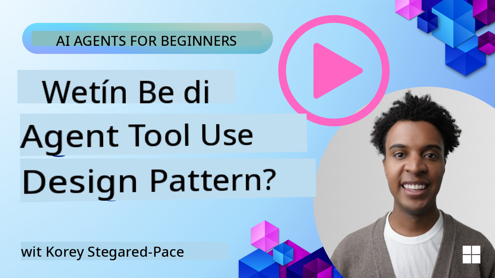
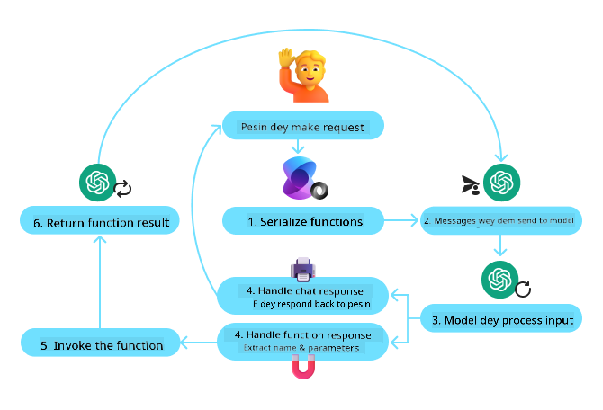
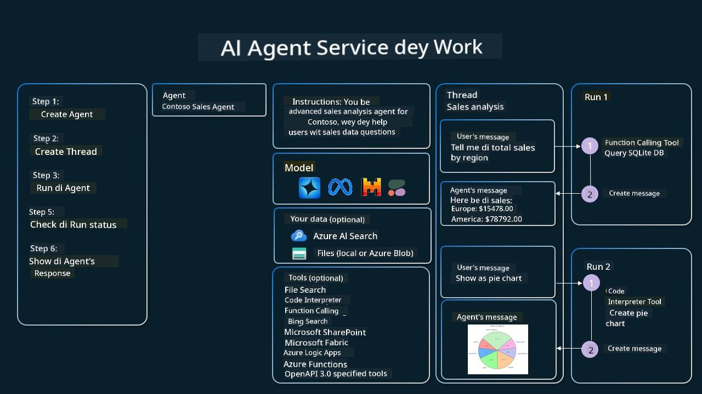

<!--
CO_OP_TRANSLATOR_METADATA:
{
  "original_hash": "d7c3b7bd1b3528074d8b6a7c5ad33b6f",
  "translation_date": "2025-11-18T18:47:56+00:00",
  "source_file": "04-tool-use/README.md",
  "language_code": "pcm"
}
-->
[](https://youtu.be/vieRiPRx-gI?si=cEZ8ApnT6Sus9rhn)

> _(Click di image wey dey up to watch di video for dis lesson)_

# Tool Use Design Pattern

Tools dey interesting because dem dey allow AI agents get plenty power. Instead make di agent get small actions wey e fit do, if you add tool, di agent fit do plenty actions. For dis chapter, we go look di Tool Use Design Pattern, wey dey explain how AI agents fit use special tools to achieve wetin dem wan do.

## Introduction

For dis lesson, we wan answer dis questions:

- Wetin be tool use design pattern?
- Wetin be di use cases wey e fit work for?
- Wetin be di elements/building blocks wey we need to implement di design pattern?
- Wetin be di special things we need to think about to use Tool Use Design Pattern build AI agents wey people fit trust?

## Learning Goals

After you finish dis lesson, you go fit:

- Explain wetin Tool Use Design Pattern mean and wetin e dey do.
- Identify di use cases wey Tool Use Design Pattern fit work for.
- Understand di main things wey we need to implement di design pattern.
- Know di things wey go make AI agents wey dey use dis design pattern trustworthy.

## Wetin be Tool Use Design Pattern?

Di **Tool Use Design Pattern** dey focus on how LLMs fit interact with tools outside demself to achieve wetin dem wan do. Tools na code wey agent fit run to do actions. Tool fit be simple function like calculator, or API call to third-party service like stock price lookup or weather forecast. For AI agents, tools dey designed make agents fit run dem when dem need am based on **model-generated function calls**.

## Wetin be di use cases wey e fit work for?

AI Agents fit use tools to finish hard tasks, find information, or make decisions. Tool use design pattern dey useful for situations wey need dynamic interaction with external systems, like databases, web services, or code interpreters. E dey useful for plenty different use cases like:

- **Dynamic Information Retrieval:** Agents fit query external APIs or databases to get fresh data (e.g., querying SQLite database for data analysis, fetching stock prices or weather info).
- **Code Execution and Interpretation:** Agents fit run code or scripts to solve maths problems, generate reports, or do simulations.
- **Workflow Automation:** Automating repetitive or multi-step workflows by connecting tools like task schedulers, email services, or data pipelines.
- **Customer Support:** Agents fit interact with CRM systems, ticketing platforms, or knowledge bases to answer user questions.
- **Content Generation and Editing:** Agents fit use tools like grammar checkers, text summarizers, or content safety evaluators to help with content creation tasks.

## Wetin be di elements/building blocks wey we need to implement di tool use design pattern?

Dis building blocks dey help AI agent do plenty tasks. Make we look di main things wey we need to implement Tool Use Design Pattern:

- **Function/Tool Schemas**: Detailed definitions of di tools wey dey available, including function name, wetin e dey do, di parameters wey e need, and di output wey e go give. Dis schemas dey help LLM understand di tools wey dey available and how to make correct requests.

- **Function Execution Logic**: E dey control how and when tools go run based on wetin di user wan do and di conversation context. E fit include planner modules, routing mechanisms, or conditional flows wey dey decide tool usage dynamically.

- **Message Handling System**: E dey manage di flow of conversation between user inputs, LLM responses, tool calls, and tool outputs.

- **Tool Integration Framework**: Infrastructure wey dey connect di agent to different tools, whether na simple functions or big external services.

- **Error Handling & Validation**: E dey handle problems wey fit happen when tool dey run, check parameters, and manage unexpected responses.

- **State Management**: E dey track conversation context, previous tool interactions, and persistent data to make sure everything dey consistent for multi-turn interactions.

Next, make we look Function/Tool Calling well.

### Function/Tool Calling

Function calling na di main way we dey make Large Language Models (LLMs) interact with tools. You go see 'Function' and 'Tool' dey used interchangeably because 'functions' (blocks of reusable code) na di 'tools' wey agents dey use to do tasks. For function code to run, LLM go compare wetin user wan do with di function description. To do dis, schema wey get di descriptions of all di available functions go dey sent to di LLM. Di LLM go then choose di function wey fit di task and return di name and arguments. Di chosen function go run, e response go go back to di LLM, wey go use di information answer di user.

For developers to implement function calling for agents, you go need:

1. LLM model wey support function calling
2. Schema wey get function descriptions
3. Di code for each function wey dem describe

Make we use example of getting di current time for one city explain:

1. **Initialize LLM wey support function calling:**

    No be all models dey support function calling, so you need check di LLM wey you dey use. <a href="https://learn.microsoft.com/azure/ai-services/openai/how-to/function-calling" target="_blank">Azure OpenAI</a> dey support function calling. We fit start by initiating di Azure OpenAI client.

    ```python
    # Initialize the Azure OpenAI client
    client = AzureOpenAI(
        azure_endpoint = os.getenv("AZURE_OPENAI_ENDPOINT"), 
        api_key=os.getenv("AZURE_OPENAI_API_KEY"),  
        api_version="2024-05-01-preview"
    )
    ```

1. **Create Function Schema**:

    Next, we go define JSON schema wey get di function name, wetin di function dey do, and di names and descriptions of di function parameters. We go then carry dis schema pass am to di client wey we create before, plus di user request to find di time for San Francisco. Wetin important be say na **tool call** go return, **no be** di final answer to di question. As we talk before, di LLM go return di name of di function wey e choose for di task, and di arguments wey e go pass to am.

    ```python
    # Function description for the model to read
    tools = [
        {
            "type": "function",
            "function": {
                "name": "get_current_time",
                "description": "Get the current time in a given location",
                "parameters": {
                    "type": "object",
                    "properties": {
                        "location": {
                            "type": "string",
                            "description": "The city name, e.g. San Francisco",
                        },
                    },
                    "required": ["location"],
                },
            }
        }
    ]
    ```
   
    ```python
  
    # Initial user message
    messages = [{"role": "user", "content": "What's the current time in San Francisco"}] 
  
    # First API call: Ask the model to use the function
      response = client.chat.completions.create(
          model=deployment_name,
          messages=messages,
          tools=tools,
          tool_choice="auto",
      )
  
      # Process the model's response
      response_message = response.choices[0].message
      messages.append(response_message)
  
      print("Model's response:")  

      print(response_message)
  
    ```

    ```bash
    Model's response:
    ChatCompletionMessage(content=None, role='assistant', function_call=None, tool_calls=[ChatCompletionMessageToolCall(id='call_pOsKdUlqvdyttYB67MOj434b', function=Function(arguments='{"location":"San Francisco"}', name='get_current_time'), type='function')])
    ```
  
1. **Di function code wey go do di task:**

    Now wey di LLM don choose di function wey need to run, di code wey go do di task go need to dey implemented and executed. We fit write di code to get di current time for Python. We go also need write di code to extract di name and arguments from di response_message to get di final result.

    ```python
      def get_current_time(location):
        """Get the current time for a given location"""
        print(f"get_current_time called with location: {location}")  
        location_lower = location.lower()
        
        for key, timezone in TIMEZONE_DATA.items():
            if key in location_lower:
                print(f"Timezone found for {key}")  
                current_time = datetime.now(ZoneInfo(timezone)).strftime("%I:%M %p")
                return json.dumps({
                    "location": location,
                    "current_time": current_time
                })
      
        print(f"No timezone data found for {location_lower}")  
        return json.dumps({"location": location, "current_time": "unknown"})
    ```

     ```python
     # Handle function calls
      if response_message.tool_calls:
          for tool_call in response_message.tool_calls:
              if tool_call.function.name == "get_current_time":
     
                  function_args = json.loads(tool_call.function.arguments)
     
                  time_response = get_current_time(
                      location=function_args.get("location")
                  )
     
                  messages.append({
                      "tool_call_id": tool_call.id,
                      "role": "tool",
                      "name": "get_current_time",
                      "content": time_response,
                  })
      else:
          print("No tool calls were made by the model.")  
  
      # Second API call: Get the final response from the model
      final_response = client.chat.completions.create(
          model=deployment_name,
          messages=messages,
      )
  
      return final_response.choices[0].message.content
     ```

     ```bash
      get_current_time called with location: San Francisco
      Timezone found for san francisco
      The current time in San Francisco is 09:24 AM.
     ```

Function Calling na di main thing for most agent tool use design, but to implement am from scratch fit hard sometimes. As we learn for [Lesson 2](../../../02-explore-agentic-frameworks) agentic frameworks dey give us pre-built building blocks to implement tool use.

## Tool Use Examples with Agentic Frameworks

Here be some examples of how you fit implement Tool Use Design Pattern using different agentic frameworks:

### Semantic Kernel

<a href="https://learn.microsoft.com/azure/ai-services/agents/overview" target="_blank">Semantic Kernel</a> na open-source AI framework for .NET, Python, and Java developers wey dey work with Large Language Models (LLMs). E dey make di process of using function calling easy by automatically describing your functions and di parameters to di model through one process wey dem dey call <a href="https://learn.microsoft.com/semantic-kernel/concepts/ai-services/chat-completion/function-calling/?pivots=programming-language-python#1-serializing-the-functions" target="_blank">serializing</a>. E dey also handle di back-and-forth communication between di model and your code. Another advantage of using agentic framework like Semantic Kernel be say e dey allow you access pre-built tools like <a href="https://github.com/microsoft/semantic-kernel/blob/main/python/samples/getting_started_with_agents/openai_assistant/step4_assistant_tool_file_search.py" target="_blank">File Search</a> and <a href="https://github.com/microsoft/semantic-kernel/blob/main/python/samples/getting_started_with_agents/openai_assistant/step3_assistant_tool_code_interpreter.py" target="_blank">Code Interpreter</a>.

Di diagram wey dey below dey show how function calling dey work with Semantic Kernel:



For Semantic Kernel, functions/tools dey called <a href="https://learn.microsoft.com/semantic-kernel/concepts/plugins/?pivots=programming-language-python" target="_blank">Plugins</a>. We fit turn di `get_current_time` function wey we see before into plugin by turning am into class wey get di function inside. We fit also import di `kernel_function` decorator, wey dey take di description of di function. When you create kernel with GetCurrentTimePlugin, di kernel go automatically serialize di function and di parameters, create di schema to send to di LLM.

```python
from semantic_kernel.functions import kernel_function

class GetCurrentTimePlugin:
    async def __init__(self, location):
        self.location = location

    @kernel_function(
        description="Get the current time for a given location"
    )
    def get_current_time(location: str = ""):
        ...

```

```python 
from semantic_kernel import Kernel

# Create the kernel
kernel = Kernel()

# Create the plugin
get_current_time_plugin = GetCurrentTimePlugin(location)

# Add the plugin to the kernel
kernel.add_plugin(get_current_time_plugin)
```
  
### Azure AI Agent Service

<a href="https://learn.microsoft.com/azure/ai-services/agents/overview" target="_blank">Azure AI Agent Service</a> na new agentic framework wey dey help developers build, deploy, and scale AI agents wey dey secure without needing to manage di compute and storage resources. E dey useful for enterprise applications because e na fully managed service wey get enterprise grade security.

If you compare am to developing with di LLM API directly, Azure AI Agent Service dey give some advantages, like:

- Automatic tool calling – you no need parse tool call, run di tool, and handle di response; all dis dey done server-side
- Securely managed data – instead of managing your own conversation state, you fit use threads to store all di information wey you need
- Out-of-the-box tools – Tools wey you fit use to interact with your data sources, like Bing, Azure AI Search, and Azure Functions.

Di tools wey dey Azure AI Agent Service fit dey divided into two categories:

1. Knowledge Tools:
    - <a href="https://learn.microsoft.com/azure/ai-services/agents/how-to/tools/bing-grounding?tabs=python&pivots=overview" target="_blank">Grounding with Bing Search</a>
    - <a href="https://learn.microsoft.com/azure/ai-services/agents/how-to/tools/file-search?tabs=python&pivots=overview" target="_blank">File Search</a>
    - <a href="https://learn.microsoft.com/azure/ai-services/agents/how-to/tools/azure-ai-search?tabs=azurecli%2Cpython&pivots=overview-azure-ai-search" target="_blank">Azure AI Search</a>

2. Action Tools:
    - <a href="https://learn.microsoft.com/azure/ai-services/agents/how-to/tools/function-calling?tabs=python&pivots=overview" target="_blank">Function Calling</a>
    - <a href="https://learn.microsoft.com/azure/ai-services/agents/how-to/tools/code-interpreter?tabs=python&pivots=overview" target="_blank">Code Interpreter</a>
    - <a href="https://learn.microsoft.com/azure/ai-services/agents/how-to/tools/openapi-spec?tabs=python&pivots=overview" target="_blank">OpenAPI defined tools</a>
    - <a href="https://learn.microsoft.com/azure/ai-services/agents/how-to/tools/azure-functions?pivots=overview" target="_blank">Azure Functions</a>

Di Agent Service dey allow us use dis tools together as `toolset`. E dey also use `threads` wey dey keep track of di history of messages from one conversation.

Imagine say you be sales agent for one company wey dem call Contoso. You wan develop one conversational agent wey fit answer questions about your sales data.

Di image wey dey below dey show how you fit use Azure AI Agent Service to analyze your sales data:



To use any of dis tools with di service, we fit create client and define tool or toolset. To implement dis practically, we fit use di Python code wey dey below. Di LLM go fit look di toolset and decide whether to use di user created function, `fetch_sales_data_using_sqlite_query`, or di pre-built Code Interpreter based on wetin di user wan do.

```python 
import os
from azure.ai.projects import AIProjectClient
from azure.identity import DefaultAzureCredential
from fetch_sales_data_functions import fetch_sales_data_using_sqlite_query # fetch_sales_data_using_sqlite_query function which can be found in a fetch_sales_data_functions.py file.
from azure.ai.projects.models import ToolSet, FunctionTool, CodeInterpreterTool

project_client = AIProjectClient.from_connection_string(
    credential=DefaultAzureCredential(),
    conn_str=os.environ["PROJECT_CONNECTION_STRING"],
)

# Initialize function calling agent with the fetch_sales_data_using_sqlite_query function and adding it to the toolset
fetch_data_function = FunctionTool(fetch_sales_data_using_sqlite_query)
toolset = ToolSet()
toolset.add(fetch_data_function)

# Initialize Code Interpreter tool and adding it to the toolset. 
code_interpreter = code_interpreter = CodeInterpreterTool()
toolset = ToolSet()
toolset.add(code_interpreter)

agent = project_client.agents.create_agent(
    model="gpt-4o-mini", name="my-agent", instructions="You are helpful agent", 
    toolset=toolset
)
```

## Wetin be di special things we need to think about to use Tool Use Design Pattern build AI agents wey people fit trust?

One common concern with SQL wey LLMs dey generate dynamically na security, especially di risk of SQL injection or bad actions, like dropping or tampering with di database. Even though dis concerns dey valid, we fit stop di problem by configuring database access permissions well. For most databases, dis go mean configuring di database as read-only. For database services like PostgreSQL or Azure SQL, di app go need read-only (SELECT) role.
To run di app for secure environment go make di protection strong well well. For enterprise matter, dem dey usually carry data comot, change am from di operational systems, den put am for read-only database or data warehouse wey get user-friendly schema. Dis kain method dey make sure say di data dey secure, e go perform well, e go easy to access, and di app go only fit read di data, e no go fit change am.

## Sample Codes

- Python: [Agent Framework](./code_samples/04-python-agent-framework.ipynb)
- .NET: [Agent Framework](./code_samples/04-dotnet-agent-framework.md)

## You get more questions about how to use di Tool Design Patterns?

Join di [Azure AI Foundry Discord](https://aka.ms/ai-agents/discord) to meet other people wey dey learn, attend office hours, and get answers to your AI Agents questions.

## Extra Resources

- <a href="https://microsoft.github.io/build-your-first-agent-with-azure-ai-agent-service-workshop/" target="_blank">Azure AI Agents Service Workshop</a>
- <a href="https://github.com/Azure-Samples/contoso-creative-writer/tree/main/docs/workshop" target="_blank">Contoso Creative Writer Multi-Agent Workshop</a>
- <a href="https://learn.microsoft.com/semantic-kernel/concepts/ai-services/chat-completion/function-calling/?pivots=programming-language-python#1-serializing-the-functions" target="_blank">Semantic Kernel Function Calling Tutorial</a>
- <a href="https://github.com/microsoft/semantic-kernel/blob/main/python/samples/getting_started_with_agents/openai_assistant/step3_assistant_tool_code_interpreter.py" target="_blank">Semantic Kernel Code Interpreter</a>
- <a href="https://microsoft.github.io/autogen/dev/user-guide/core-user-guide/components/tools.html" target="_blank">Autogen Tools</a>

## Previous Lesson

[Understanding Agentic Design Patterns](../03-agentic-design-patterns/README.md)

## Next Lesson

[Agentic RAG](../05-agentic-rag/README.md)

---

<!-- CO-OP TRANSLATOR DISCLAIMER START -->
**Disclaimer**:  
Dis dokyument don use AI transleshion service [Co-op Translator](https://github.com/Azure/co-op-translator) do di transleshion. Even though we dey try make am accurate, abeg make you sabi say automatik transleshion fit get mistake or no dey correct well. Di original dokyument for im native language na di main source wey you go fit trust. For important informashon, e good make you use professional human transleshion. We no go fit take blame for any misunderstanding or wrong meaning wey fit happen because you use dis transleshion.
<!-- CO-OP TRANSLATOR DISCLAIMER END -->