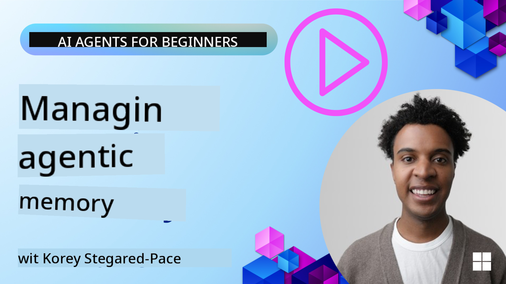

<!--
CO_OP_TRANSLATOR_METADATA:
{
  "original_hash": "d2c9703548140bafa2d6a77406552542",
  "translation_date": "2025-11-11T14:12:33+00:00",
  "source_file": "13-agent-memory/README.md",
  "language_code": "pcm"
}
-->
# Memory for AI Agents 

Wen we dey talk about di special benefits of creating AI Agents, two main tins dey wey people dey discuss: di ability to use tools finish tasks and di ability to dey improve as time dey go. Memory na di foundation wey dey help create self-improving agent wey fit give beta experience to our users.

For dis lesson, we go look wetin memory mean for AI Agents and how we fit manage am and use am to benefit our applications.

## Introduction

Dis lesson go cover:

• **Understanding AI Agent Memory**: Wetin memory be and why e dey important for agents.

• **Implementing and Storing Memory**: Practical ways to add memory ability to your AI agents, wey go focus on short-term and long-term memory.

• **Making AI Agents Self-Improving**: How memory dey help agents learn from past interactions and dey improve as time dey go.

## Learning Goals

After you finish dis lesson, you go sabi how to:

• **Know di different types of AI agent memory**, like working, short-term, and long-term memory, plus special types like persona and episodic memory.

• **Implement and manage short-term and long-term memory for AI agents** using Semantic Kernel framework, tools like Mem0 and Whiteboard memory, and how to connect am with Azure AI Search.

• **Understand di principles behind self-improving AI agents** and how strong memory management systems dey help agents learn and adapt better.

## Understanding AI Agent Memory

For di main level, **memory for AI agents na di way dem dey keep and remember information**. Dis information fit be details about conversation, user preferences, past actions, or even patterns wey dem don learn.

Without memory, AI applications go dey like say dem no get sense, meaning every interaction go dey start afresh. Dis one dey make user experience dey tire person because di agent go dey "forget" di previous context or preferences.

### Why Memory Important?

Di intelligence of agent dey depend well well on how e fit remember and use past information. Memory dey make agents:

• **Reflective**: Learn from past actions and results.

• **Interactive**: Keep di context of di conversation wey dey go on.

• **Proactive and Reactive**: Fit predict wetin person need or respond well based on past data.

• **Autonomous**: Fit dey work on dia own by using di knowledge wey dem don store.

Di main aim of memory na to make agents dey **reliable and capable**.

### Types of Memory

#### Working Memory

Dis one be like scratch paper wey agent dey use for one task or thought process wey dey happen. E dey hold di immediate information wey dem need to do di next step.

For AI agents, working memory dey capture di most important information from conversation, even if di full chat history long or dem cut am short. E dey focus on di key tins like requirements, proposals, decisions, and actions.

**Working Memory Example**

For travel booking agent, working memory fit hold di user request like "I wan book trip go Paris". Dis specific request go dey di agent mind to guide di interaction wey dey happen.

#### Short Term Memory

Dis type of memory dey keep information for di time wey one conversation or session dey happen. E dey keep di context of di chat wey dey go on, so di agent fit refer back to di previous talk.

**Short Term Memory Example**

If user ask, "How much flight go Paris go cost?" and later talk "Wetin of accommodation for dia?", short-term memory go make di agent sabi say "dia" mean "Paris" for di same conversation.

#### Long Term Memory

Dis one na di memory wey dey last for many conversations or sessions. E dey help agents remember user preferences, past interactions, or general knowledge for long time. E dey important for personalization.

**Long Term Memory Example**

Long-term memory fit store say "Ben like skiing and outdoor activities, e like coffee wey dey mountain view, and e no wan advanced ski slopes because of one injury wey e get before". Dis information wey di agent don learn from past interactions go help am give better recommendations for future travel plans.

#### Persona Memory

Dis type of memory dey help agent get one kind "personality" or "persona". E dey make di agent remember tins about itself or di role wey e suppose play, so di interaction go dey smooth and focused.

**Persona Memory Example**
If di travel agent na "expert ski planner," persona memory go make di agent dey act like expert, dey give answers wey match di expert tone and knowledge.

#### Workflow/Episodic Memory

Dis memory dey keep di steps wey agent dey take for one complex task, including wetin work and wetin no work. E dey like remembering specific "episodes" or past experiences to learn from dem.

**Episodic Memory Example**

If di agent try book one flight but e no work because e no dey available, episodic memory fit keep dis failure, so di agent go try another flight or tell di user wetin happen for di next attempt.

#### Entity Memory

Dis one dey involve di agent dey pick and remember specific entities (like people, places, or tins) and events from conversation. E dey help di agent build structured understanding of di key tins wey dem talk about.

**Entity Memory Example**

From one conversation about past trip, di agent fit pick "Paris," "Eiffel Tower," and "dinner for Le Chat Noir restaurant" as entities. For future interaction, di agent fit remember "Le Chat Noir" and offer to book another reservation dia.

#### Structured RAG (Retrieval Augmented Generation)

Even though RAG na general technique, "Structured RAG" dey stand out as strong memory technology. E dey pick structured information from different sources (conversations, emails, images) and use am to give better precision, recall, and speed for responses. Unlike di normal RAG wey dey depend only on semantic similarity, Structured RAG dey work with di structure of di information.

**Structured RAG Example**

Instead of just matching keywords, Structured RAG fit read flight details (destination, date, time, airline) from email and keep dem in structured way. Dis go make query like "Wetin be di flight wey I book go Paris on Tuesday?" dey more accurate.

## Implementing and Storing Memory

To add memory for AI agents, you go need to follow di process of **memory management**, wey include generating, storing, retrieving, integrating, updating, and even "forgetting" (or deleting) information. Retrieval na di main part.

### Specialized Memory Tools

One way to store and manage agent memory na to use special tools like Mem0. Mem0 dey work as persistent memory layer, wey dey help agents remember important interactions, store user preferences and factual context, and learn from wetin work and wetin no work over time. Di idea na to change agents wey no dey keep memory to ones wey dey keep am.

E dey work with **two-phase memory pipeline: extraction and update**. First, messages wey dem add to agent thread go enter Mem0 service, wey go use Large Language Model (LLM) summarize di conversation history and pick new memories. After dat, di LLM-driven update phase go decide whether to add, change, or delete di memories, and store dem for hybrid data store wey fit include vector, graph, and key-value databases. Dis system fit also support different memory types and fit use graph memory to manage relationships between entities.

### Storing Memory with RAG

Apart from special memory tools like Mem0, you fit use strong search services like **Azure AI Search as backend to store and retrieve memories**, especially for structured RAG.

Dis go make di agent responses dey grounded with your own data, so e go dey more relevant and accurate. Azure AI Search fit store user-specific travel memories, product catalogs, or any other domain-specific knowledge.

Azure AI Search dey support tins like **Structured RAG**, wey dey good for picking and retrieving structured information from big datasets like conversation histories, emails, or even images. Dis dey give "superhuman precision and recall" compared to di normal text chunking and embedding methods.

## Making AI Agents Self-Improve

One common way to make agents dey improve na to add **"knowledge agent"**. Dis separate agent dey watch di main conversation between di user and di primary agent. Di work wey e dey do na:

1. **Pick important information**: Check if any part of di conversation dey important to save as general knowledge or user preference.

2. **Extract and summarize**: Pick di main point or preference from di conversation.

3. **Store am for knowledge base**: Keep di information wey e pick, usually for vector database, so e fit dey available later.

4. **Add am to future queries**: Wen di user ask new question, di knowledge agent go bring di stored information wey dey relevant and add am to di user prompt, so e go give di primary agent better context (like RAG).

### Optimizations for Memory

• **Latency Management**: To make sure user interaction no slow down, you fit use cheaper, faster model first to check if di information dey important to store or retrieve, before you use di more complex process wen e dey necessary.

• **Knowledge Base Maintenance**: For knowledge base wey dey grow, information wey people no dey use often fit move to "cold storage" to reduce cost.

## Got More Questions About Agent Memory?

Join di [Azure AI Foundry Discord](https://aka.ms/ai-agents/discord) to meet other learners, attend office hours and get answers to your AI Agents questions.

---

<!-- CO-OP TRANSLATOR DISCLAIMER START -->
**Disclaimer**:  
Dis dokyument don use AI translation service [Co-op Translator](https://github.com/Azure/co-op-translator) do di translation. Even as we dey try make am accurate, abeg sabi say automated translations fit get mistake or no dey correct well. Di original dokyument for im native language na di main source wey you go fit trust. For important information, e good make professional human translation dey use. We no go fit take blame for any misunderstanding or wrong interpretation wey fit happen because you use dis translation.
<!-- CO-OP TRANSLATOR DISCLAIMER END -->