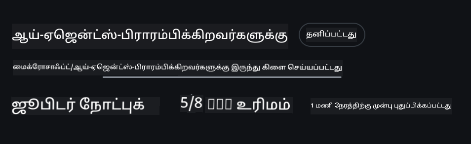
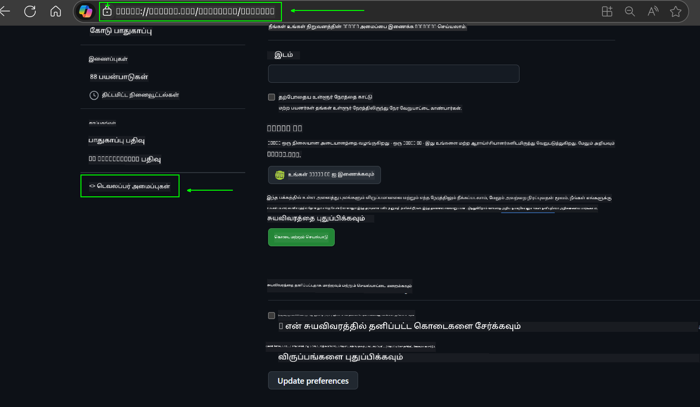
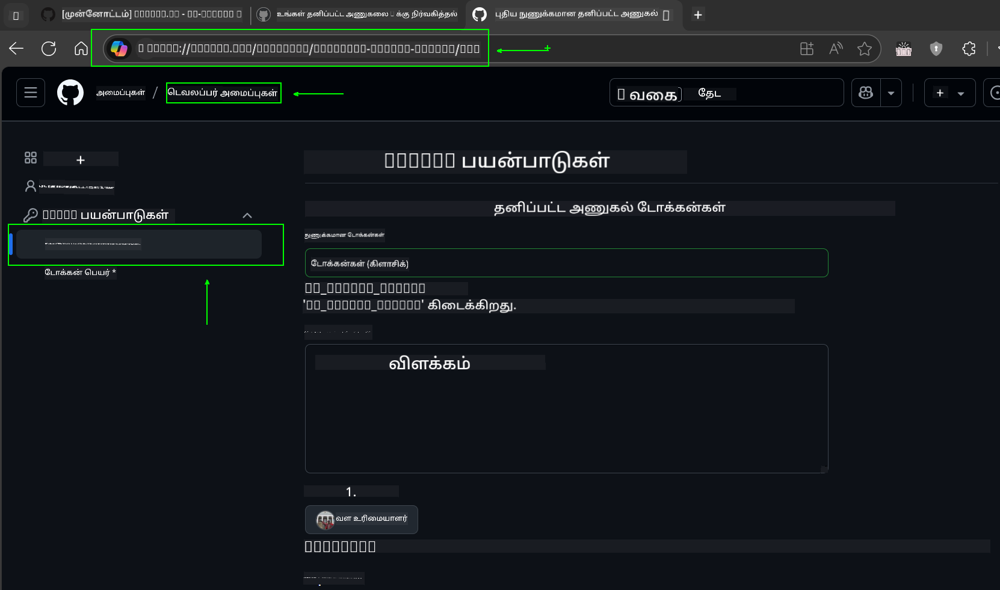
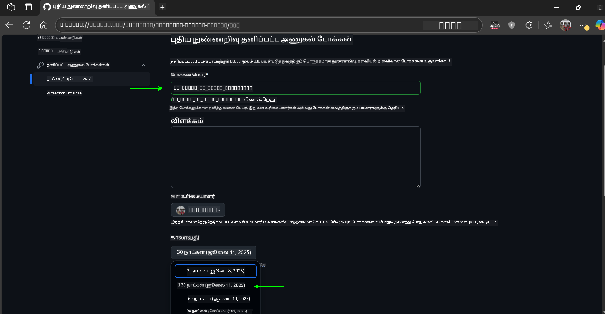
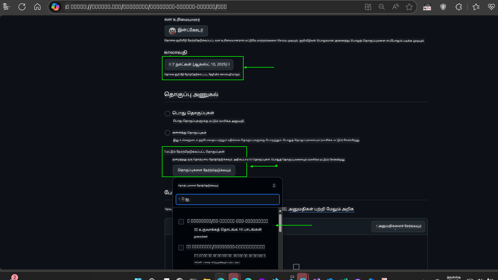
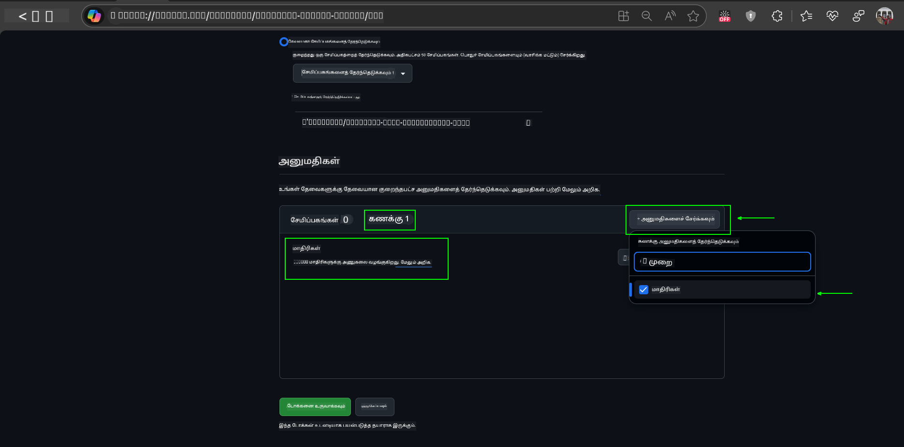
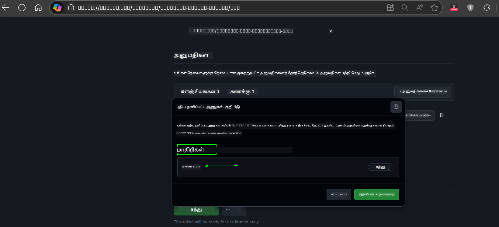
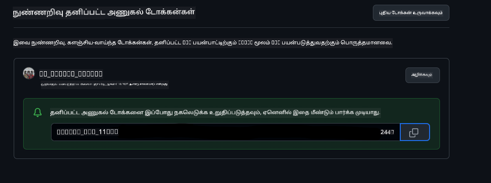
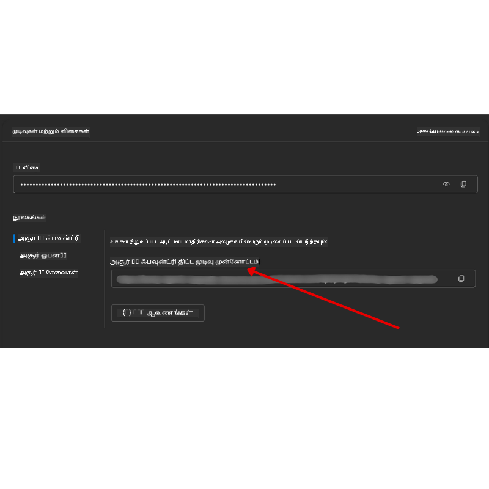

<!--
CO_OP_TRANSLATOR_METADATA:
{
  "original_hash": "86273689a010b5efecaf7fa23104e0fb",
  "translation_date": "2025-11-07T08:53:55+00:00",
  "source_file": "00-course-setup/README.md",
  "language_code": "ta"
}
-->
# பாடநெறி அமைப்பு

## அறிமுகம்

இந்த பாடத்தில், இந்த பாடநெறியின் குறியீட்டு மாதிரிகளை இயக்குவது எப்படி என்பதைப் பற்றி கற்றுக்கொள்வீர்கள்.

## மற்ற கற்றவர்களுடன் சேர்ந்து உதவி பெறுங்கள்

உங்கள் ரெப்போவை கிளோன் செய்ய ஆரம்பிக்கும்முன், [AI Agents For Beginners Discord சேனலில்](https://aka.ms/ai-agents/discord) சேர்ந்து அமைப்பில் உதவி பெறவும், பாடநெறி குறித்த கேள்விகளை கேட்கவும் அல்லது மற்ற கற்றவர்களுடன் தொடர்பு கொள்ளவும்.

## இந்த ரெப்போவை கிளோன் செய்யவும் அல்லது ஃபோர்க் செய்யவும்

தொடங்க, தயவுசெய்து GitHub Repository ஐ கிளோன் செய்யவும் அல்லது ஃபோர்க் செய்யவும். இது பாடநெறி பொருட்களின் உங்கள் சொந்த பதிப்பை உருவாக்க உதவும், இதனால் நீங்கள் குறியீட்டை இயக்க, சோதிக்க மற்றும் மாற்ற முடியும்!

இதைச் செய்ய, <a href="https://github.com/microsoft/ai-agents-for-beginners/fork" target="_blank">ரெப்போவை ஃபோர்க் செய்ய</a> இணைப்பைக் கிளிக் செய்யவும்.

இப்போது, இந்த பாடநெறியின் உங்கள் சொந்த ஃபோர்க் செய்யப்பட்ட பதிப்பு பின்வரும் இணைப்பில் இருக்கும்:



### சுருக்கமான கிளோன் (பயிற்சி / Codespaces க்கு பரிந்துரைக்கப்படுகிறது)

  >முழு ரெப்போசிட்டரி பெரியதாக இருக்கலாம் (~3 GB) முழு வரலாற்றையும் அனைத்து கோப்புகளையும் பதிவிறக்கம் செய்யும்போது. நீங்கள் பயிற்சியில் மட்டுமே பங்கேற்கிறீர்கள் அல்லது சில பாட கோப்புறைகளை மட்டுமே தேவைப்படுகிறீர்கள் என்றால், சுருக்கமான கிளோன் (அல்லது sparse clone) வரலாற்றை குறைத்து அல்லது தேவையற்ற கோப்புகளை தவிர்த்து பெரும்பாலான பதிவிறக்கத்தை தவிர்க்க உதவும்.

#### விரைவான சுருக்கமான கிளோன் — குறைந்த வரலாறு, அனைத்து கோப்புகளும்

கீழே உள்ள கட்டளைகளில் `<your-username>` ஐ உங்கள் ஃபோர்க் URL (அல்லது நீங்கள் விரும்பினால் upstream URL) மூலம் மாற்றவும்.

சமீபத்திய கமிட் வரலாற்றை மட்டுமே கிளோன் செய்ய:

```bash|powershell
git clone --depth 1 https://github.com/<your-username>/ai-agents-for-beginners.git
```

ஒரு குறிப்பிட்ட கிளையை கிளோன் செய்ய:

```bash|powershell
git clone --depth 1 --branch <branch-name> https://github.com/<your-username>/ai-agents-for-beginners.git
```

#### பகுதி (sparse) கிளோன் — குறைந்த blobs + தேர்ந்தெடுக்கப்பட்ட கோப்புறைகள் மட்டுமே

இது பகுதி கிளோன் மற்றும் sparse-checkout ஐப் பயன்படுத்துகிறது (Git 2.25+ தேவை மற்றும் பகுதி கிளோன் ஆதரவு கொண்ட நவீன Git பரிந்துரைக்கப்படுகிறது):

```bash|powershell
git clone --depth 1 --filter=blob:none --sparse https://github.com/<your-username>/ai-agents-for-beginners.git
```

ரெப்போ கோப்புறைக்குள் செல்லவும்:

```bash|powershell
cd ai-agents-for-beginners
```

பின்னர் நீங்கள் எந்த கோப்புறைகளை விரும்புகிறீர்கள் என்பதை குறிப்பிடவும் (கீழே உள்ள உதாரணம் இரண்டு கோப்புறைகளை காட்டுகிறது):

```bash|powershell
git sparse-checkout set 00-course-setup 01-intro-to-ai-agents
```

கோப்புகளை கிளோன் செய்து சரிபார்த்த பிறகு, நீங்கள் கோப்புகளை மட்டுமே தேவைப்படுகிறீர்கள் மற்றும் இடத்தை விடுவிக்க விரும்பினால் (git வரலாறு இல்லை), ரெப்போசிட்டரி மெட்டாடேட்டாவை நீக்கவும் (💀மீட்டெடுக்க முடியாதது — அனைத்து Git செயல்பாடுகளையும் இழக்க நேரிடும்: கமிட்கள், pulls, pushes, அல்லது வரலாறு அணுகல்).

```bash
# zsh/bash
rm -rf .git
```

```powershell
# PowerShell
Remove-Item -Recurse -Force .git
```

#### GitHub Codespaces பயன்படுத்துதல் (உள்ளூர் பெரிய பதிவிறக்கங்களை தவிர்க்க பரிந்துரைக்கப்படுகிறது)

- இந்த ரெப்போவிற்கான புதிய Codespace ஐ [GitHub UI](https://github.com/codespaces) மூலம் உருவாக்கவும்.  

- புதிய Codespace இன் டெர்மினலில், மேலே உள்ள சுருக்கமான/பகுதி கிளோன் கட்டளைகளில் ஒன்றை இயக்கி, உங்களுக்கு தேவையான பாட கோப்புறைகளை மட்டுமே Codespace வேலைப்பகுதிக்குள் கொண்டு வரவும்.
- விருப்பமாக: Codespaces உள்ளே கிளோன் செய்த பிறகு, .git ஐ நீக்கி கூடுதல் இடத்தை மீட்டெடுக்கவும் (மேலே உள்ள நீக்க கட்டளைகளைப் பார்க்கவும்).
- குறிப்பு: நீங்கள் ரெப்போவை நேரடியாக Codespaces இல் திறக்க விரும்பினால் (கூடுதல் கிளோன் இல்லாமல்), Codespaces devcontainer சூழலை உருவாக்கும் மற்றும் உங்களுக்கு தேவையானதை விட அதிகமாக வழங்கலாம் என்பதை கவனத்தில் கொள்ளவும். புதிய Codespace உள்ளே சுருக்கமான நகலை கிளோன் செய்வது டிஸ்க் பயன்பாட்டை மேலாண்மை செய்ய அதிக கட்டுப்பாட்டை வழங்கும்.

#### குறிப்புகள்

- நீங்கள் திருத்த/கமிட் செய்ய விரும்பினால், உங்கள் ஃபோர்க் URL ஐ எப்போதும் மாற்றவும்.
- பின்னர் மேலும் வரலாறு அல்லது கோப்புகள் தேவைப்பட்டால், அவற்றை fetch செய்யலாம் அல்லது sparse-checkout ஐச் சரிசெய்து கூடுதல் கோப்புறைகளைச் சேர்க்கலாம்.

## குறியீட்டை இயக்குதல்

இந்த பாடநெறி, AI Agents உருவாக்குவதற்கான அனுபவத்தைப் பெற Jupyter Notebooks தொடர்களை வழங்குகிறது.

குறியீட்டு மாதிரிகள் பின்வருமாறு பயன்படுத்தப்படுகின்றன:

**GitHub கணக்கு தேவை - இலவசம்**:

1) Semantic Kernel Agent Framework + GitHub Models Marketplace. (semantic-kernel.ipynb) என லேபிள் செய்யப்பட்டுள்ளது.
2) AutoGen Framework + GitHub Models Marketplace. (autogen.ipynb) என லேபிள் செய்யப்பட்டுள்ளது.

**Azure சந்தா தேவை**:
3) Azure AI Foundry + Azure AI Agent Service. (azureaiagent.ipynb) என லேபிள் செய்யப்பட்டுள்ளது.

இந்த மூன்று வகையான உதாரணங்களையும் முயற்சிக்குமாறு உங்களை ஊக்குவிக்கிறோம், எது உங்களுக்கு சிறந்தது என்பதைப் பார்க்க.

நீங்கள் எந்த விருப்பத்தைத் தேர்ந்தெடுத்தாலும், அதற்கேற்ப கீழே உள்ள அமைப்பு படிகளை நீங்கள் பின்பற்ற வேண்டும்:

## தேவைகள்

- Python 3.12+
  - **NOTE**: Python3.12 நிறுவப்படவில்லை என்றால், அதை நிறுவவும். பின்னர் python3.12 ஐப் பயன்படுத்தி உங்கள் venv ஐ உருவாக்கவும், இதனால் requirements.txt கோப்பிலிருந்து சரியான பதிப்புகள் நிறுவப்படும்.
  
    >உதாரணம்

    Python venv கோப்புறை உருவாக்கவும்:

    ```bash|powershell
    python -m venv venv
    ```

    பின்னர் venv சூழலை செயல்படுத்தவும்:

    ```bash
    # zsh/bash
    source venv/bin/activate
    ```
  
    ```dos
    # Command Prompt for Windows
    venv\Scripts\activate
    ```

- .NET 10+: .NET ஐப் பயன்படுத்தும் மாதிரிக்குறியீடுகளுக்கு, [.NET 10 SDK](https://dotnet.microsoft.com/download/dotnet/10.0) அல்லது அதற்கு மேல் நிறுவவும். பின்னர், நிறுவப்பட்ட .NET SDK பதிப்பைச் சரிபார்க்கவும்:

    ```bash|powershell
    dotnet --list-sdks
    ```

- GitHub கணக்கு - GitHub Models Marketplace அணுக
- Azure சந்தா - Azure AI Foundry அணுக
- Azure AI Foundry கணக்கு - Azure AI Agent Service அணுக

இந்த ரெப்போசிட்டரியின் மூலத்தில் `requirements.txt` கோப்பை சேர்த்துள்ளோம், இது குறியீட்டு மாதிரிகளை இயக்க தேவையான அனைத்து Python தொகுதிகளையும் கொண்டுள்ளது.

நீங்கள் அதை ரெப்போசிட்டரியின் மூலத்தில் உங்கள் டெர்மினலில் பின்வரும் கட்டளையை இயக்குவதன் மூலம் நிறுவலாம்:

```bash|powershell
pip install -r requirements.txt
```

எந்தவொரு முரண்பாடுகளையும் மற்றும் சிக்கல்களையும் தவிர்க்க Python மெய்நிகர் சூழலை உருவாக்க பரிந்துரைக்கப்படுகிறது.

## VSCode அமைப்பு

VSCode இல் சரியான Python பதிப்பைப் பயன்படுத்துகிறீர்கள் என்பதை உறுதிசெய்க.


## GitHub Models உதாரணங்களுக்கான அமைப்பு 

### படி 1: உங்கள் GitHub தனிப்பட்ட அணுகல் டோக்கனை (PAT) பெறவும்

இந்த பாடநெறி GitHub Models Marketplace ஐ பயன்படுத்துகிறது, இது உங்களுக்கு இலவசமாக பெரிய மொழி மாதிரிகளை (LLMs) அணுக அனுமதிக்கிறது, இதன் மூலம் நீங்கள் AI Agents உருவாக்க முடியும்.

GitHub Models ஐப் பயன்படுத்த, நீங்கள் [GitHub Personal Access Token](https://docs.github.com/en/authentication/keeping-your-account-and-data-secure/managing-your-personal-access-tokens) ஐ உருவாக்க வேண்டும்.

இது உங்கள் GitHub கணக்கில் உள்ள <a href="https://github.com/settings/personal-access-tokens" target="_blank">Personal Access Tokens settings</a> சென்று செய்யலாம்.

உங்கள் டோக்கனை உருவாக்கும்போது [குறைந்த அனுமதியின் கொள்கையை](https://docs.github.com/en/get-started/learning-to-code/storing-your-secrets-safely) பின்பற்றவும். இது இந்த பாடநெறியில் உள்ள குறியீட்டு மாதிரிகளை இயக்க டோக்கனுக்கு தேவையான அனுமதிகளை மட்டுமே வழங்க வேண்டும் என்பதைக் குறிக்கிறது.

1. உங்கள் திரையின் இடது பக்கத்தில் **Developer settings** சென்று `Fine-grained tokens` விருப்பத்தைத் தேர்ந்தெடுக்கவும்.

   

   பின்னர் `Generate new token` ஐத் தேர்ந்தெடுக்கவும்.

   

2. உங்கள் டோக்கனின் நோக்கத்தை பிரதிபலிக்கும் விளக்கமான பெயரை உள்ளிடவும், பின்னர் அதை அடையாளம் காண எளிதாக இருக்கும்.

    🔐 டோக்கன் காலவரையறை பரிந்துரை

    பரிந்துரைக்கப்பட்ட காலம்: 30 நாட்கள்  
    மேலும் பாதுகாப்பான நிலைப்பாட்டிற்காக, குறுகிய காலத்தைத் தேர்ந்தெடுக்கலாம்—7 நாட்கள் 🛡️  
    இது ஒரு தனிப்பட்ட இலக்கை அமைக்கவும், உங்கள் கற்றல் வேகத்தை அதிகரிக்கவும் ஒரு சிறந்த வழியாகும் 🚀.

    

3. டோக்கனின் பரந்தியை உங்கள் ரெப்போ ஃபோர்க் வரை மட்டுமே வரையறுக்கவும்.

    

4. டோக்கனின் அனுமதிகளை வரையறுக்கவும்: **Permissions** கீழ், **Account** தாவலை கிளிக் செய்து, "+ Add permissions" பொத்தானை கிளிக் செய்யவும். ஒரு டிராப்டவுன் தோன்றும். **Models** ஐத் தேடி, அதற்கான பெட்டியைச் சரிபார்க்கவும்.

    

5. டோக்கனை உருவாக்குவதற்கு முன் தேவையான அனுமதிகளை சரிபார்க்கவும். 

6. டோக்கனை உருவாக்குவதற்கு முன், அதை ஒரு பாதுகாப்பான இடத்தில் (கடவுச்சொல் மேலாளர் போன்றது) சேமிக்க தயாராக இருக்கவும், ஏனெனில் நீங்கள் அதை மீண்டும் காண முடியாது. 

உங்கள் புதிய டோக்கனை நகலெடுக்கவும். இப்போது இந்த பாடநெறியில் உள்ள `.env` கோப்பில் இதைச் சேர்க்க வேண்டும்.

### படி 2: உங்கள் `.env` கோப்பை உருவாக்கவும்

உங்கள் `.env` கோப்பை உருவாக்க, உங்கள் டெர்மினலில் பின்வரும் கட்டளையை இயக்கவும்.

```bash
# zsh/bash
cp .env.example .env
```

```powershell
# PowerShell
Copy-Item .env.example .env
```

இது எடுத்துக்காட்டு கோப்பை நகலெடுத்து, உங்கள் கோப்புறையில் `.env` ஐ உருவாக்கும், அங்கு நீங்கள் சூழல் மாறிகளுக்கான மதிப்புகளை நிரப்ப வேண்டும்.

உங்கள் டோக்கனை நகலெடுத்து, உங்கள் விருப்பமான உரை திருத்தியில் `.env` கோப்பைத் திறந்து, உங்கள் டோக்கனை `GITHUB_TOKEN` புலத்தில் ஒட்டவும்.


இப்போது நீங்கள் இந்த பாடநெறியின் குறியீட்டு மாதிரிகளை இயக்க முடியும்.

## Azure AI Foundry மற்றும் Azure AI Agent Service உதாரணங்களுக்கான அமைப்பு

### படி 1: உங்கள் Azure திட்டத்தின் இறுதிநிலையைப் பெறவும்

Azure AI Foundry இல் ஒரு hub மற்றும் திட்டத்தை உருவாக்குவதற்கான படிகளை இங்கே பின்பற்றவும்: [Hub resources overview](https://learn.microsoft.com/azure/ai-foundry/concepts/ai-resources)

நீங்கள் உங்கள் திட்டத்தை உருவாக்கிய பிறகு, உங்கள் திட்டத்திற்கான இணைப்பு சரத்தைப் பெற வேண்டும்.

இது Azure AI Foundry போர்டலின் **Overview** பக்கத்திற்குச் சென்று செய்யலாம்.



### Step 2: Create Your `.env` File

To create your `.env` file run the following command in your terminal.

```bash
# zsh/bash
cp .env.example .env
```

```powershell
# PowerShell
Copy-Item .env.example .env
```

This will copy the example file and create a `.env` in your directory and where you fill in the values for the environment variables.

With your token copied, open the `.env` file in your favorite text editor and paste your token into the `PROJECT_ENDPOINT` field.

### Step 3: Sign in to Azure

As a security best practice, we'll use [keyless authentication](https://learn.microsoft.com/azure/developer/ai/keyless-connections?tabs=csharp%2Cazure-cli?WT.mc_id=academic-105485-koreyst) to authenticate to Azure OpenAI with Microsoft Entra ID. 

Next, open a terminal and run `az login --use-device-code` to sign in to your Azure account.

Once you've logged in, select your subscription in the terminal.

## Additional Environment Variables - Azure Search and Azure OpenAI 

For the Agentic RAG Lesson - Lesson 5 - there are samples that use Azure Search and Azure OpenAI.

If you want to run these samples, you will need to add the following environment variables to your `.env` file:

### Overview Page (Project)

- `AZURE_SUBSCRIPTION_ID` - Check **Project details** on the **Overview** page of your project.

- `AZURE_AI_PROJECT_NAME` - Look at the top of the **Overview** page for your project.

- `AZURE_OPENAI_SERVICE` - Find this in the **Included capabilities** tab for **Azure OpenAI Service** on the **Overview** page.

### Management Center

- `AZURE_OPENAI_RESOURCE_GROUP` - Go to **Project properties** on the **Overview** page of the **Management Center**.

- `GLOBAL_LLM_SERVICE` - Under **Connected resources**, find the **Azure AI Services** connection name. If not listed, check the **Azure portal** under your resource group for the AI Services resource name.

### Models + Endpoints Page

- `AZURE_OPENAI_EMBEDDING_DEPLOYMENT_NAME` - Select your embedding model (e.g., `text-embedding-ada-002`) and note the **Deployment name** from the model details.

- `AZURE_OPENAI_CHAT_DEPLOYMENT_NAME` - Select your chat model (e.g., `gpt-4o-mini`) and note the **Deployment name** from the model details.

### Azure Portal

- `AZURE_OPENAI_ENDPOINT` - Look for **Azure AI services**, click on it, then go to **Resource Management**, **Keys and Endpoint**, scroll down to the "Azure OpenAI endpoints", and copy the one that says "Language APIs".

- `AZURE_OPENAI_API_KEY` - From the same screen, copy KEY 1 or KEY 2.

- `AZURE_SEARCH_SERVICE_ENDPOINT` - Find your **Azure AI Search** resource, click it, and see **Overview**.

- `AZURE_SEARCH_API_KEY` - Then go to **Settings** and then **Keys** to copy the primary or secondary admin key.

### External Webpage

- `AZURE_OPENAI_API_VERSION` - Visit the [API version lifecycle](https://learn.microsoft.com/azure/ai-services/openai/api-version-deprecation#latest-ga-api-release) page under **Latest GA API release**.

### Setup keyless authentication

Rather than hardcode your credentials, we'll use a keyless connection with Azure OpenAI. To do so, we'll import `DefaultAzureCredential` and later call the `DefaultAzureCredential` function to get the credential.

```python
# Python
from azure.identity import DefaultAzureCredential, InteractiveBrowserCredential
```

## எங்காவது சிக்கலா?
இந்த அமைப்பை இயக்குவதில் ஏதேனும் சிக்கல்கள் இருந்தால், எங்கள் <a href="https://discord.gg/kzRShWzttr" target="_blank">Azure AI Community Discord</a> அல்லது <a href="https://github.com/microsoft/ai-agents-for-beginners/issues?WT.mc_id=academic-105485-koreyst" target="_blank">ஒரு பிரச்சினையை உருவாக்கவும்</a>.

## அடுத்த பாடம்

இந்த பாடத்திற்கான குறியீட்டை இயக்க தயாராக உள்ளீர்கள். AI முகவர்களின் உலகத்தை மேலும் அறிந்து மகிழுங்கள்!

[AI முகவர்கள் மற்றும் முகவர் பயன்பாட்டு வழக்குகளுக்கான அறிமுகம்](../01-intro-to-ai-agents/README.md)

---

**குறிப்பு**:  
இந்த ஆவணம் AI மொழிபெயர்ப்பு சேவை [Co-op Translator](https://github.com/Azure/co-op-translator) பயன்படுத்தி மொழிபெயர்க்கப்பட்டுள்ளது. நாங்கள் துல்லியத்திற்காக முயற்சிக்கிறோம், ஆனால் தானியங்கி மொழிபெயர்ப்புகளில் பிழைகள் அல்லது தவறுகள் இருக்கக்கூடும் என்பதை கவனத்தில் கொள்ளவும். அதன் தாய்மொழியில் உள்ள மூல ஆவணம் அதிகாரப்பூர்வ ஆதாரமாக கருதப்பட வேண்டும். முக்கியமான தகவல்களுக்கு, தொழில்முறை மனித மொழிபெயர்ப்பு பரிந்துரைக்கப்படுகிறது. இந்த மொழிபெயர்ப்பைப் பயன்படுத்துவதால் ஏற்படும் எந்த தவறான புரிதல்கள் அல்லது தவறான விளக்கங்களுக்கு நாங்கள் பொறுப்பல்ல.